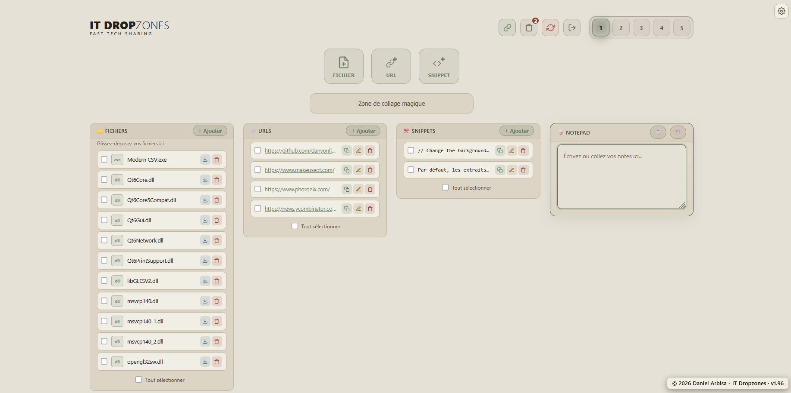

# IT Dropzones

A small, self-hosted web app for quickly sharing files, links, text snippets and notes — no database, no user accounts, just a password.

Built for personal / small-team use: 5 independent workspaces, installable as an app (PWA) on mobile and desktop, and usable for temporary public sharing.



## Features

- **5 independent workspaces**, each with its own files, URLs, snippets and a notepad.
- **Smart input**: paste or type content into a single field and the app automatically routes links to URLs and everything else to Snippets.
- **Drag-and-drop** file uploads, paste images directly from the clipboard.
- **New file button**: create a blank `.txt` or `.md` file directly from the Files column, without uploading anything first.
- **Markdown editor**: `.md` files open in a dedicated editor with a live rendered preview (GitHub-style typography, tables, code blocks) and an auto-generated "Contents" sidebar for quick navigation between headings (hidden on mobile, where screen space is limited). A tab switches to raw source editing. Plain text files (and Markdown, before editing) open read-only in a preview first, with an explicit toggle to switch into edit mode.
- **Word (.docx) files**: hosted, shared and downloaded like any other file — no in-browser viewing, editing or creation.
- **Move items between workspaces** by dragging one or several selected items onto another workspace tab — hold **Ctrl** while dropping to copy instead of move.
- **Share files or snippets publicly** by dragging one or more files, or one or more snippets (together, if several), onto the URLs column: a single public link is created, added as one URL item, giving access to all of them. Visiting the link shows the same app, but stripped down to just a read-only Files (or Snippets) column with only those items — no workspace tabs, no other columns. Deleting that URL item revokes the link immediately; restoring it from the trash re-enables it. Clicking that URL item's edit icon opens dedicated share settings: an optional password, editing the link's label, seeing (and removing) individual shared items with a "seen/not seen" indicator per item (files: based on whether the recipient downloaded it; snippets: based on whether the recipient copied or opened it), and the total number of times the link was opened (shown right next to the link in the URLs list).
- **Per-item QR codes**: any file, URL, snippet or the notepad can generate a temporary QR code from its menu — scanning it downloads the file or copies the text to the phone's clipboard. The underlying share is revoked automatically as soon as the QR code is closed.
- **Bulk actions**: select multiple files, URLs or snippets to delete them at once, download selected files as a ZIP, or copy selected snippets to the clipboard (newline-separated). Action buttons on each item are revealed on hover in "ungrouped" display mode, keeping item names readable at full width.
- **Public sharing of a workspace** via a link (read-only, or read + write), revocable at any time. Activate it by dragging a workspace tab onto the Add URL button or the URLs column (the link is copied to the clipboard automatically), or via right-click (long-press on mobile) on the workspace tab, which offers "Share" or "Manage sharing" depending on its current state. The share dialog shows the link, a QR code for it, a copy button, and the read/write toggle. Shared workspaces are visually flagged on their tab. The notepad's Time Slider (revision history) is never exposed to shared-link visitors, even with write access — only the current version is visible to them.
- **Trash** with restore, automatic 30-day retention. The trash icon's item count updates live as things are deleted.
- **QR code sign-in**: scan a link with any QR code reader app — or with the built-in scanner button on mobile — from a device that's already signed in, to instantly authorize a new device for 1 hour without retyping the password.
- **Installable PWA** (home screen icon on mobile, full-screen mode).
- **Password authentication**, with an optional "stay signed in" (7 days).
- **Passkey sign-in** (HTTPS only): register a passkey from Settings, then sign in with it instead of the password. Any registered passkey also becomes a mandatory extra confirmation step when approving a QR sign-in for a desktop, in addition to the session/24h/7-day choice.
- Custom name per workspace, plus an optional app-wide logo.
- **Multilingual UI**: French, English and Basque, with a discreet language switcher (top-right corner). The choice is remembered in a cookie.
- **Multiple color themes** (Iluna, Natura, Amber, Zuri-beltz, Beltz-zuri, Marrazkia), selectable per browser in Settings, with a Docker-configurable default.
- **Display preferences**: hide empty columns or the notepad, remembered per browser.
- **Notepad Time Slider** (à la Etherpad): scrub through past autosaved revisions of a workspace's notepad and restore any of them. The last 200 revisions are kept per workspace (owner only, see sharing note above).
- Viewing a snippet full-screen offers Previous/Next navigation to browse through the column, plus a delete button, without returning to the list each time.

## Tech stack

- **Backend**: Python / Flask, single file (`app.py`)
- **Storage**: plain JSON files on disk (`uploads/`) — no database
- **Frontend**: HTML/CSS/JS embedded in Jinja2 templates, no front-end framework
- **Production server**: Gunicorn (see `Dockerfile`)

## Local setup

```bash
pip install -r requirements.txt
python app.py
```

The app starts on `http://localhost:5000`.

## Environment variables

| Variable       | Default                                               | Description                                                                         |
|----------------|--------------------------------------------------------|--------------------------------------------------------------------------------------|
| `PASSWORD`     | `yourpassword`                                              | Access password for the application                                                  |
| `DEFAULT_LANG` | `fr`                                                    | Default UI language when no language cookie is set yet. One of `fr`, `en`, `eu`.     |
| `DEFAULT_THEME`| `iluna`                                                | Default color theme when no theme cookie is set yet. One of `iluna`, `natura`, `amber`, `zuri-beltz`, `beltz-zuri`, `marrazkia`. |
| `SECRET_KEY`   | auto-generated and stored in `uploads/secret_key.txt`  | Flask session signing key. Set it explicitly if you run multiple workers/instances.   |

## Docker

```bash
docker build -t it-dropzones .
docker run -p 5000:5000 \
  -e PASSWORD=your_password \
  -e DEFAULT_LANG=en \
  -v $(pwd)/uploads:/app/uploads \
  it-dropzones
```

Or with Docker Compose (see `docker-compose.yml`):

```bash
docker compose up -d --build
```

⚠️ Make sure to mount `/app/uploads` as a volume: it holds uploaded files, the data store (`data.json`), auth tokens, registered passkeys (`passkeys.json`), API keys (`api_keys.json`) and the secret key. Without it, everything is lost on every container redeploy.

## API

Generate an API key from Settings ("API keys" section) to send files, URLs or snippets from an external script or automation tool, without a browser session. Send the key as a bearer token (or `X-API-Key`):

```bash
curl -X POST https://your-domain/api/urls \
  -H "Authorization: Bearer <api-key>" \
  -H "Content-Type: application/json" \
  -d '{"ws": 1, "url": "https://example.com", "label": "optional"}'

curl -X POST https://your-domain/api/snippets \
  -H "Authorization: Bearer <api-key>" \
  -H "Content-Type: application/json" \
  -d '{"ws": 1, "text": "some text", "label": "optional"}'

curl -X POST https://your-domain/api/files \
  -H "Authorization: Bearer <api-key>" \
  -F "ws=1" -F "file=@/path/to/file.pdf"
```

`ws` selects the target workspace (1–5, defaults to 1). Responses are JSON: `{"status": "success"}`, `{"status": "duplicate", ...}` for a URL/snippet already present, or a 4xx status with `{"status": "error", "message": "..."}`. Revoking a key from Settings takes effect immediately.

## Sharing a workspace

Public sharing is only available when the app is served over HTTPS on a real domain (it's disabled for local/LAN access, where full access is already direct). Each share link can be instantly revoked by the workspace owner, and write access (add/edit/delete) can be toggled independently from read access.

## Security

- Auth cookie is `HttpOnly`, `Secure` (over HTTPS), `SameSite=Lax`.
- Single shared password — no multi-account management. Change `PASSWORD` before deploying.
- Set `SECRET_KEY` explicitly in production if the app runs with multiple workers or multiple instances.
- Passkeys are also a single flat list, not scoped per device/user: any registered passkey grants the same full access as the password, and requires HTTPS (WebAuthn is unavailable over plain HTTP, except `localhost`).
- API keys can only add content (files/URLs/snippets) — they cannot delete, share, or change settings. Only the hash is stored; the plaintext key is shown once, at creation.
- File/snippet share links (`/shared_files/...`) are public and unauthenticated by design, like workspace share links — anyone with the URL can view/download the specific files or snippets it covers, and no others in that workspace. Same HTTPS-only restriction as workspace sharing.

---

© 2026 Argitasuna
